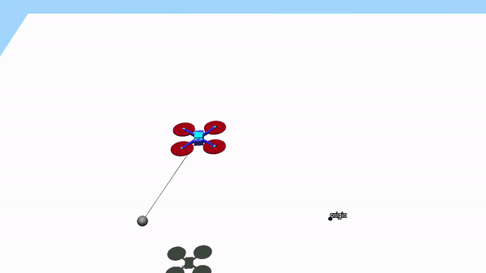

# udaan

A collection of simulation and control scripts written/developed as part of my thesis, Dynamics and Control for Collaborative Aerial Manipulation.

This package contains mathematical models for quadrotor(s) with suspended payload(s) and controllers for the same. Models are either written manually or modeled using `pybullet` or `mujoco` simulators. 


## Models

<table>
  <tr>
    <th>Name</th>
    <th>Remarks</th>
  </tr>
  <tr>
    <td>Quadrotor
      <p float="left">
        
      </p>
    </td>
    <td>
      <ul>
        <li>Geometric control on SE(3): <a href="https://ieeexplore.ieee.org/document/5717652">paper</a>, <a href="https://ieeexplore.ieee.org/document/5717652">code</a></li>
        <li>MPC on variation linearized dynamics [3]. TODO</li>
      </ul>
    </td>
  </tr>
  <tr>
    <td>Quadrotor Comparison
      <p float="left">
        
      </p>
    </td>
    <td>
      <ul>
        <li>Geometric L1 Adaptive control on SO(3) [2]. TODO</li>
      </ul>
    </td>
  </tr>
  <tr>
    <td> Quadrotor with Cable Suspended Payload
      <p float="left">
        
      </p>
    </td>
    <td>
      <ul>
        <li>Geometric control on SE(3)xS2. <a href="https://ieeexplore.ieee.org/abstract/document/6760219">[4]</a></li>
        <li>MPC on variation linearized dynamics [5]. TODO</li>
      </ul>
    </td>
  </tr>
</table>

--- 

## Citations

- Dynamics and Control for Collaborative Aerial Manipulation, Prasanth Kotaru, Ph.D. Dissertation, UC Berkeley, December 2022.
  
  ```
  @phdthesis{kotaru2022dynamics,
    title={Dynamics and Control for Collaborative Aerial Manipulation},
    author={Kotaru, Prasanth},
    year={2022},
    school={UC Berkeley}
  }
  ```

For individual controllers cite the corresponding papers linked in the above table.

---

&copy; [Prasanth Kotaru](github.com/vkotaru)

