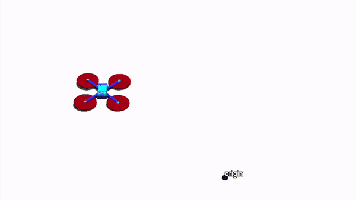
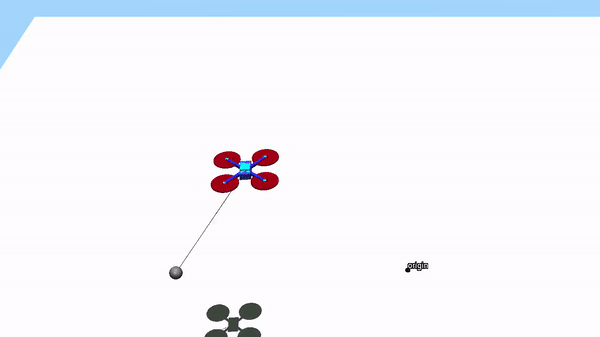

# udaan

A Python framework for research, development, and learning of quadrotor cable-suspended payload systems — covering dynamics simulation and geometric control on Lie groups.

Developed as part of the thesis: *Dynamics and Control for Collaborative Aerial Manipulation* ([Kotaru, 2022](https://github.com/vkotaru)).

> **Note:** The original research code was developed in [vkotaru/floating_models](https://github.com/vkotaru/floating_models). This package (`udaan`) is the cleaned-up, unified public release, refactored with the aid of [Claude](https://claude.ai) under the careful guidance of the author.

## Installation

```bash
pip install -e .
```

MuJoCo is included as a core dependency. VPython visualization is optional:
```bash
pip install -e ".[all]"
```

## Quick Start

### CLI

```bash
udaan run quadrotor -t 10                     # quadrotor with geometric control
udaan run quad-payload -t 10 -m tendon        # quadrotor + cable-suspended payload
udaan run multi-quad -n 3 -t 10               # multi-quadrotor cooperative payload
udaan run quadrotor -b base --no-render       # base model (no MuJoCo)
```

### Python

```python
import udaan as U
import numpy as np

mdl = U.models.mujoco.Quadrotor(render=True)
mdl.simulate(tf=10, position=np.array([1., 1., 0.]))
```

## Models

| | Quadrotor | Quadrotor + Payload |
|---|---|---|
| **Preview** |  |  |
| **State space** | SE(3) | SE(3) x S2 |
| **Backends** | Base, MuJoCo | Base, MuJoCo (tendon, links) |
| **CLI** | `udaan run quadrotor` | `udaan run quad-payload` |

Additional MuJoCo models: multi-quadrotor pointmass payload (`udaan run multi-quad`), multi-quadrotor rigid-body payload, quadrotor comparison (plant vs reference).

<details>
<summary><strong>Controller roadmap</strong></summary>

| Controller | System | Status | Reference |
|-----------|--------|--------|-----------|
| Geometric PD (SE(3)) | Quadrotor | :white_check_mark: Implemented | [Lee, Leok, McClamroch 2010](https://ieeexplore.ieee.org/document/5717652) |
| Geometric PD (SE(3) x S2) | Quad + Payload | :white_check_mark: Implemented | [Sreenath, Lee, Kumar 2013](https://ieeexplore.ieee.org/abstract/document/6760219) |
| L1 Adaptive (SO(3)) | Quadrotor | :white_check_mark: Implemented | [Kotaru, Wu, Sreenath 2020](https://doi.org/10.1115/1.4045558) |
| Propeller Force Allocation | Quadrotor | :white_check_mark: Implemented | — |
| Differential Flatness | Quad + Payload | :construction: Partial (flat2state utils) | [Sreenath, Lee, Kumar 2013](https://ieeexplore.ieee.org/abstract/document/6760219) |
| NLMPC (CasADi) | Quadrotor | :memo: Planned | — |
| VBLMPC | Quad + Payload | :memo: Planned | [Kotaru, Sreenath 2020](https://hybrid-robotics.berkeley.edu/publications/) |
| Geometric PD | Multi-Quad Payload | :memo: Planned | [Lee 2014](https://ieeexplore.ieee.org/document/6907452) |
| RL (Gymnasium) | All | :memo: Planned | — |

</details>

<details>
<summary><strong>Package API reference</strong></summary>

### Base Models (`udaan.models.base`)

Math-only dynamics, no simulator dependency.

| Model | State Space | Description |
|-------|------------|-------------|
| `Quadrotor` | SE(3) | Rigid body quadrotor, wrench/accel/prop-force inputs |
| `QuadrotorCSPayload` | SE(3) x S2 | Quadrotor + cable-suspended point-mass payload |
| `FloatingPointmass` | R3 | 3D point mass with gravity |
| `S2Pendulum` | S2 | Spherical pendulum on the 2-sphere |
| `PointmassSuspendedPayload` | R3 x S2 | Single point-mass agent with suspended payload |
| `MultiPointmassSuspendedPayload` | R3 x (S2)^n | Multiple point-mass agents, shared payload |

### MuJoCo Models (`udaan.models.mujoco`)

MuJoCo-backed physics with GLFW visualization.

| Model | Description |
|-------|-------------|
| `Quadrotor` | Single quadrotor |
| `QuadrotorCSPayload` | Quad + payload (tendon or links cable model) |
| `MultiQuadrotorCSPointmass` | N quadrotors, shared point-mass payload |
| `MultiQuadRigidbody` | N quadrotors, shared rigid-body payload |
| `QuadrotorComparison` | Side-by-side plant vs reference quadrotor |

### Manifold Library (`udaan.manif`)

| Class/Function | Description |
|---------------|-------------|
| `SO3` | Rotation matrix with exponential map stepping |
| `S2` | Unit sphere with geodesic stepping, config error |
| `hat` / `vee` | Skew-symmetric matrix operators |
| `rodrigues_expm` | Rodrigues rotation formula |
| `expm_taylor_expansion` | Matrix exponential Taylor approximation |

### Utilities (`udaan.utils`)

| Module | Description |
|--------|-------------|
| `trajectory` | Smooth, polynomial, circular, and Lissajous trajectory generators |
| `flat2state` | Differential flatness maps for quadrotor and payload systems |
| `assets` | MuJoCo XML model generator |
| `vfx` | VPython-based visualization (base models) |

</details>

## License

BSD 3-Clause License. See [LICENSE](LICENSE) for details.
