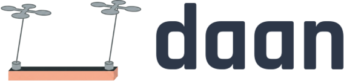
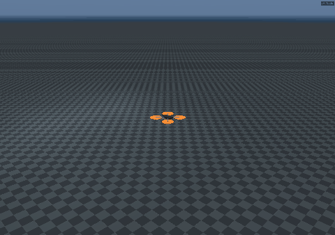
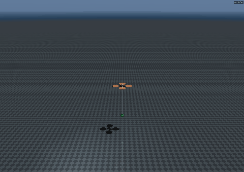
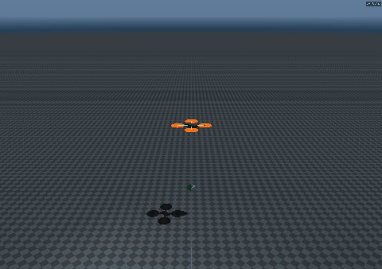
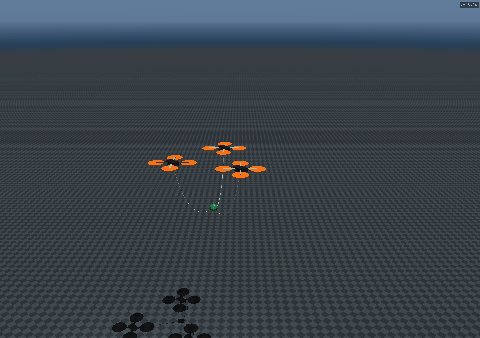
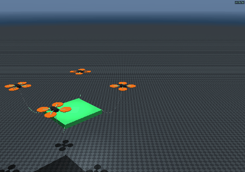
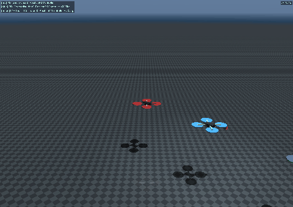

<p align="center">
  
</p>

<p align="center">
  <strong> A Python mujoco based models and controllers for quadcopter cable-suspended payload systems.</strong>
</p>

<p align="center">
  <a href="https://github.com/vkotaru/udaan/actions"></a>
  <a href="https://github.com/vkotaru/udaan/blob/main/LICENSE"></a>
  <a href="https://pypi.org/project/udaan/"></a>
  <a href="https://mujoco.org"></a>
</p>

---

<p align="center">
  
  
  
</p>
<p align="center">
  
  
  
</p>

---

> Developed as part of the thesis: _Dynamics and Control for Collaborative Aerial Manipulation_ ([Kotaru, 2022](https://github.com/vkotaru)).
> Original research code: [vkotaru/floating_models](https://github.com/vkotaru/floating_models). This package is the cleaned-up public release, refactored with [Claude](https://claude.ai).

## Features

|                                                      |                                                                    |
| ---------------------------------------------------- | ------------------------------------------------------------------ |
| :helicopter: **Quadrotor dynamics**                  | Single and multi-vehicle SE(3) rigid-body simulation               |
| :control_knobs: **Geometric controllers**            | PD on SE(3), L1 adaptive on SO(3), force allocation                |
| :chains: **Cable-suspended payloads**                | Tendon and multi-link cable models with S2 pendulum dynamics       |
| :people_holding_hands: **Cooperative transport**     | N-quadrotor point-mass and rigid-body payload systems              |
| :joystick: **MuJoCo integration**                    | Physics-backed simulation with GLFW rendering and GIF recording    |
| :straight_ruler: **Manifold library**                | SO(3), S2 exponential maps, geodesic stepping, config errors       |
| :chart_with_upwards_trend: **Trajectory generation** | Polynomial, circular, Lissajous, and smooth reference trajectories |
| :desktop_computer: **CLI interface**                 | `udaan run` commands for quick demos and experiments               |

## Installation

```bash
pip install -e .
```

MuJoCo is included as a core dependency. VPython visualization is optional:

```bash
pip install -e ".[all]"
```

## Quick Start

### CLI

```bash
udaan run quadrotor -t 10                             # quadrotor with geometric control
udaan run quad-payload -t 10 -m tendon                # quadrotor + cable-suspended payload
udaan run multi-quad -n 3 -t 10                       # multi-quadrotor cooperative payload
udaan run multi-quad-rigid -t 10                      # multi-quadrotor rigid-body payload
udaan run fleet --demo l1-comparison -t 10            # L1 vs PD controller comparison
udaan run fleet --demo gain-sweep -t 10               # PD gain tuning comparison
udaan run quadrotor -t 5 -r out.gif                   # record to GIF
```

### Python

```python
import udaan as U
import numpy as np

mdl = U.models.mujoco.Quadrotor(render=True)
mdl.simulate(tf=10, position=np.array([1., 1., 0.]))
```

## Documentation

<details>
<summary><strong>:pushpin: Controller roadmap</strong></summary>

| Controller                    | System             | Status                                    | Reference                                                                          |
| ----------------------------- | ------------------ | ----------------------------------------- | ---------------------------------------------------------------------------------- |
| Geometric PD (SE(3))          | Quadrotor          | :white_check_mark: Implemented            | [Lee, Leok, McClamroch 2010](https://ieeexplore.ieee.org/document/5717652)         |
| Geometric L1 Adaptive (SO(3)) | Quadrotor          | :white_check_mark: Implemented            | [Kotaru, Wu, Sreenath 2020](https://doi.org/10.1115/1.4045558)                     |
| Geometric PD (SE(3) x S2)     | Quad + Payload     | :white_check_mark: Implemented            | [Sreenath, Lee, Kumar 2013](https://ieeexplore.ieee.org/abstract/document/6760219) |
| Propeller Force Allocation    | Quadrotor          | :white_check_mark: Implemented            | —                                                                                  |
| Differential Flatness         | Quad + Payload     | :construction: Partial (flat2state utils) | [Sreenath, Lee, Kumar 2013](https://ieeexplore.ieee.org/abstract/document/6760219) |
| NLMPC (CasADi)                | Quadrotor          | :memo: Planned                            | —                                                                                  |
| VBLMPC                        | Quad + Payload     | :memo: Planned                            | [Kotaru, Sreenath 2020](https://hybrid-robotics.berkeley.edu/publications/)        |
| Geometric PD                  | Multi-Quad Payload | :memo: Planned                            | [Lee 2014](https://ieeexplore.ieee.org/document/6907452)                           |
| RL (Gymnasium)                | All                | :memo: Planned                            | —                                                                                  |

</details>

<details>
<summary><strong>:package: Package API reference</strong></summary>

### Base Models (`udaan.models.base`)

Math-only dynamics, no simulator dependency.

| Model                            | State Space | Description                                          |
| -------------------------------- | ----------- | ---------------------------------------------------- |
| `Quadrotor`                      | SE(3)       | Rigid body quadrotor, wrench/accel/prop-force inputs |
| `QuadrotorCSPayload`             | SE(3) x S2  | Quadrotor + cable-suspended point-mass payload       |
| `FloatingPointmass`              | R3          | 3D point mass with gravity                           |
| `S2Pendulum`                     | S2          | Spherical pendulum on the 2-sphere                   |
| `PointmassSuspendedPayload`      | R3 x S2     | Single point-mass agent with suspended payload       |
| `MultiPointmassSuspendedPayload` | R3 x (S2)^n | Multiple point-mass agents, shared payload           |

### MuJoCo Models (`udaan.models.mujoco`)

MuJoCo-backed physics with GLFW visualization.

| Model                       | Description                                        |
| --------------------------- | -------------------------------------------------- |
| `Quadrotor`                 | Single quadrotor                                   |
| `QuadrotorCSPayload`        | Quad + payload (tendon or links cable model)       |
| `MultiQuadrotorCSPointmass` | N quadrotors, shared point-mass payload            |
| `MultiQuadRigidbody`        | N quadrotors, shared rigid-body payload            |
| `QuadrotorFleet`            | N independent quadrotors for controller comparison |

### Manifold Library (`udaan.manif`)

| Class/Function          | Description                                      |
| ----------------------- | ------------------------------------------------ |
| `SO3`                   | Rotation matrix with exponential map stepping    |
| `S2`                    | Unit sphere with geodesic stepping, config error |
| `hat` / `vee`           | Skew-symmetric matrix operators                  |
| `rodrigues_expm`        | Rodrigues rotation formula                       |
| `expm_taylor_expansion` | Matrix exponential Taylor approximation          |

### Utilities (`udaan.utils`)

| Module       | Description                                                       |
| ------------ | ----------------------------------------------------------------- |
| `trajectory` | Smooth, polynomial, circular, and Lissajous trajectory generators |
| `flat2state` | Differential flatness maps for quadrotor and payload systems      |
| `assets`     | MuJoCo XML model generator                                        |
| `vfx`        | VPython-based visualization (base models)                         |

</details>

## License

BSD 3-Clause License. See [LICENSE](LICENSE) for details.
