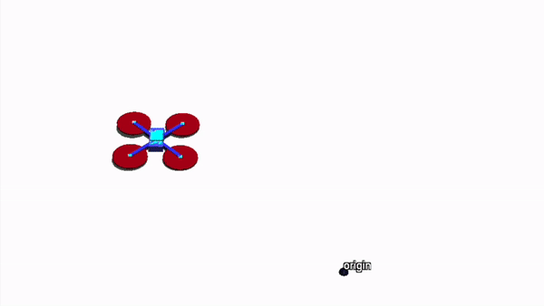

# udaan

A collection of simulation and control scripts written/developed during my stay at Hybrid Robotics;

This package contains mathematical models for quadrotor(s) with suspended payload(s) and controllers for the same. Models are either written manually or modeled using `pybullet` or `mujoco` simulators. 

### Models

<table>
  <tr>
    <th>Name</th>
    <th>Remarks</th>
  </tr>
  <tr>
    <td>Quadrotor
      

        
      

    </td>
    <td>
      <ul>
        <li>Geometric control on SE(3). <a href="https://ieeexplore.ieee.org/document/5717652">[1]</a></li>
        <li>Geometric L1 Adaptive control on SO(3) [2]. TODO</li>
        <li>MPC on variation linearized dynamics [3]. TODO</li>
      </ul>
    </td>
  </tr>
  <tr>
    <td> Quadrotor with Cable Suspended Payload
      

        
      

    </td>
    <td>
      <ul>
        <li>Geometric control on SE(3)xS2. <a href="https://ieeexplore.ieee.org/abstract/document/6760219">[4]</a></li>
        <li>MPC on variation linearized dynamics [5]. TODO</li>
      </ul>
    </td>
  </tr>
</table>

---
Other simulators for quadrotors
- [PX4 Autopilot](https://docs.px4.io/main/en/simulation/)
- [rosflight](https://github.com/rosflight/rosflight)
- [rotors_simulator](https://github.com/ethz-asl/rotors_simulator)
- [flightmare](https://github.com/uzh-rpg/flightmare)
- [AirSim](https://microsoft.github.io/AirSim/)
- [gym-pybullet-drones](https://github.com/utiasDSL/gym-pybullet-drones)

:warning: **Note:** not an exhaustive list.
